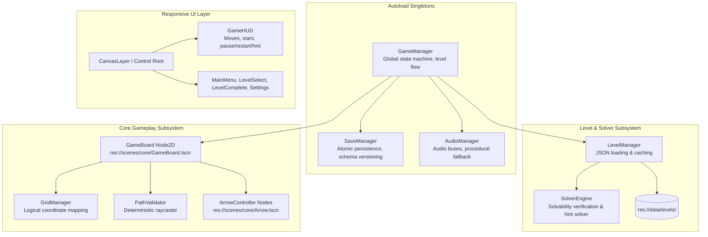

# MASTER IMPLEMENTATION PLAN
## Arrow Escape — End-to-End Publication-Ready Engineering Specification
### Godot Engine 4.x (GDScript) · Android Mobile · Version 1.0.0

---

## 1. EXECUTIVE SUMMARY & LEAD ARCHITECTURAL DIRECTIVE

**Arrow Escape** is a casual, single-player, 2D logic puzzle game designed for Android smartphones and tablets. The core mechanical promise is simple: a player observes a grid occupied by directional arrows, taps unobstructed arrows to guide them safely off the board, and logically clears the puzzle without frustration.

As Lead Software Engineer, this master implementation plan establishes an uncompromised, publication-grade architectural framework. The project is engineered for:
1. **Zero Hallucination & Drift**: Enforced by the [MEMORY_GRAPH.md](file:///e:/Projects/mobile%20application/Arrow%20Puzzle%20Game/MEMORY_GRAPH.md) and modular Standard Operating Procedures (SOP-00 to SOP-11).
2. **100% Solvability Guarantee**: Every bundled level undergoes automated algorithmic solvability verification via a backtracking solver before release.
3. **Flawless Mobile Experience**: 60 FPS guaranteed on low-end Android chipsets, responsive safe-area scaling, offline-first reliability, and atomic disaster-proof save persistence.

---

## 2. MATHEMATICAL & ALGORITHMIC SPECIFICATION

### 2.1 Coordinate Space & Board Invariants
- The board is a discrete 2D grid $G$ of dimensions $R \times C$ where rows $r \in [0, R - 1]$ and columns $c \in [0, C - 1]$.
- Position vectors are integer 2D coordinates $\mathbf{p} = (c, r) \in \mathbb{Z}^2$.
- Each arrow $A_i$ is a tuple:
  $$A_i = \left(\mathbf{p}_i, \mathbf{d}_i, \text{state}_i\right)$$
  where $\mathbf{d}_i \in \{\mathbf{d}_{\text{UP}}, \mathbf{d}_{\text{DOWN}}, \mathbf{d}_{\text{LEFT}}, \mathbf{d}_{\text{RIGHT}}\}$ and:
  $$\mathbf{d}_{\text{UP}} = (0, -1), \quad \mathbf{d}_{\text{DOWN}} = (0, 1), \quad \mathbf{d}_{\text{LEFT}} = (-1, 0), \quad \mathbf{d}_{\text{RIGHT}} = (1, 0)$$

**Invariant 1 (Single Occupancy):**
$$\forall i \neq j \implies \mathbf{p}_i \neq \mathbf{p}_j$$

### 2.2 Path Validation Function (Raycasting)
Let $\text{Occupied}(\mathbf{p}) \in \{0, 1\}$ indicate cell occupancy.
The escape trajectory of arrow $A_i$ from position $\mathbf{p}_i$ along direction $\mathbf{d}_i$ is the discrete ray:
$$\text{Ray}(A_i) = \{ \mathbf{p}_i + k \cdot \mathbf{d}_i \mid k \in \mathbb{Z}^+, \ (\mathbf{p}_i + k \cdot \mathbf{d}_i) \in G \}$$
An arrow $A_i$ is **Escapable** if and only if:
$$\forall \mathbf{q} \in \text{Ray}(A_i), \quad \text{Occupied}(\mathbf{q}) = 0$$

### 2.3 State Space & Deterministic Solvability Model
Let state $S$ be the set of active arrows on the board:
$$S = \{ A_1, A_2, \dots, A_m \}$$
A transition $S \xrightarrow{A_k} S'$ is valid if $\text{Escapable}(A_k, S) = \text{true}$, resulting in:
$$S' = S \setminus \{A_k\}$$

A level is **Solvable** if there exists an ordered sequence of moves:
$$\sigma = \langle A_{\pi(1)}, A_{\pi(2)}, \dots, A_{\pi(m)} \rangle \quad \text{such that} \quad S_0 \xrightarrow{\sigma} \emptyset$$

The solver uses Depth-First Search with a state transposition table (Zobrist hash or bitmask) to prune already-evaluated subgraphs. Time complexity is bounded to $< 5\text{ms}$ per level.

---

## 3. SYSTEM ARCHITECTURE & COMPONENT TOPOLOGY



### 3.1 Component Specifications

#### A. `GameManager` (`res://scripts/autoload/game_manager.gd`)
- Governs `GameState` (`BOOT`, `MAIN_MENU`, `LEVEL_SELECT`, `PLAYING`, `PAUSED`, `LEVEL_COMPLETE`, `SETTINGS`).
- Coordinates scene changes and emits high-level lifecycle signals.
- Tracks active level session metrics: moves taken, elapsed time, hints used.

#### B. `GridManager` (`res://scripts/core/grid_manager.gd`)
- Computes dynamic cell sizing based on viewport rect:
  $$\text{cell\_size} = \min\left(\frac{W_{\text{board}}}{C}, \frac{H_{\text{board}}}{R}\right) \times 0.94$$
- Converts grid coordinates $\mathbf{p} = (c, r)$ to local pixel offsets:
  $$\mathbf{x}_{\text{local}} = \mathbf{x}_{\text{origin}} + \left(c \cdot \text{cell\_size} + \frac{\text{cell\_size}}{2}, \ r \cdot \text{cell\_size} + \frac{\text{cell\_size}}{2}\right)$$
- Maintains logical occupancy dictionary `grid_occupancy: Dictionary[Vector2i, ArrowController]`.

#### C. `ArrowController` (`res://scenes/core/Arrow.tscn`)
- Visual node featuring:
  - Base arrow sprite / shape drawn with anti-aliased 2D rendering.
  - Direction indicator rotation (`UP`: 0°, `RIGHT`: 90°, `DOWN`: 180°, `LEFT`: 270°).
  - Touch detector via `Area2D` or native `Control` `gui_input`.
  - Tween animations for:
    - **Escape**: Smooth acceleration out of bounds (`Tween.TRANS_CUBIC`, `Tween.EASE_IN`, 0.28s).
    - **Blocked**: Gentle forward nudge (8px) and elastic rebound (`Tween.TRANS_ELASTIC`, 0.16s).
    - **Hint Glow**: Soft pulsing scale (`1.0` $\to$ `1.12` $\to$ `1.0`) with `#F6D365` accent outline.

#### D. `SaveManager` (`res://scripts/autoload/save_manager.gd`)
- Implements atomic write protocol: writes to `user://savegame.tmp`, validates string completeness, backs up existing `user://savegame.json` to `.bak`, and executes atomic rename.
- Encapsulates player progress: highest unlocked level, individual level star ratings, best moves, audio volumes, and haptic toggle.

---

## 4. UI/UX DESIGN SYSTEM & VISUAL PALETTE

Adhering strictly to modern, premium, tactile visual standards:

```
┌────────────────────────────────────────────────────────┐
│  PALETTE TOKENS                                        │
│  • Soft Cream (#F7F5EF)  -> Clean, warm background     │
│  • Light Slate (#E9E8E2) -> Puzzle board surface       │
│  • Calm Blue  (#5596E6)  -> Primary interactive arrows │
│  • Coral Pink (#F28B82)  -> Secondary/variant arrows   │
│  • Soft Yellow(#F6D365)  -> Hints, stars, focal badge  │
│  • Mint Green (#7BCFA6)  -> Victory, progression fill  │
│  • Dark Slate (#30343B)  -> High-contrast typography   │
└────────────────────────────────────────────────────────┘
```

### 4.1 Screen Hierarchy & Flows
1. **Main Menu**: Minimalist title logo, animated arrow pulse, large "Play" (resumes latest unlocked level), "Levels" button, "Settings" gear icon.
2. **Level Select**: Paginated grid of level cards (Levels 1–50+), displaying star ratings (0–3 stars) and lock icons for unreached levels.
3. **Game HUD**:
   - Header: Level label ("Level 14"), Move Counter ("Moves: 5"), Pause Button.
   - Central Playfield: Centered, aspect-ratio-scaled Board.
   - Footer: Restart Button, Hint Button (displays count / reward indicator).
4. **Level Complete Modal**:
   - Semi-transparent scrim overlay.
   - Soft spring-drop dialog card.
   - "Level Cleared!" heading.
   - Animated 3-star reveal with staggered chime audio.
   - Buttons: "Next Level" (Mint `#7BCFA6`), "Replay" (Soft Slate), "Menu".
5. **Settings Modal**:
   - Audio toggles (SFX & Music sliders).
   - Haptic vibration toggle.
   - Credits and Privacy Policy link.

---

## 5. ADVANCED VERIFICATION & VALIDATION (V&V) FRAMEWORK

To prevent regressions and ensure an enterprise-grade release, the project includes an automated test runner executed via Godot headless CLI:

### 5.1 Test Suites & Coverage Gates

| Test ID | Module | Verification Method | Assertion Criteria |
| :--- | :--- | :--- | :--- |
| **V&V-01** | `PathValidator` | Discrete Raycast Truth Table | Evaluates all 4 cardinal directions against edge bounds, adjacent obstacles, and distant blockers. Must achieve 100% precision. |
| **V&V-02** | `SolverEngine` | Algorithmic Backtracking | Solves known solvable boards, rejects deadlock boards, asserts hint arrow is valid. |
| **V&V-03** | `LevelRepository` | Mass Solvability Audit | Iterates over **100% of JSON levels** in `res://data/levels/`. Asserts valid bounds, no overlapping coordinates, and confirms at least one verified solution sequence. |
| **V&V-04** | `SaveManager` | Atomic Write & Corruption Recovery | Simulates truncated JSON payload; verifies fallback to `.bak` or default state with zero app crash. |
| **V&V-05** | `InputGatekeeper` | Debounce & Concurrency Check | Simulates 50 simultaneous tap events in a single frame; verifies only 1 escape move executes while remaining are ignored. |

### 5.2 Headless Test Runner Command
```powershell
& "D:\Godot\Godot_v4.7.2-stable_win64_console.exe" --headless -s tests/run_all_tests.gd
```

---

## 6. MILESTONE EXECUTION ROADMAP

```
M0: Architecture & Scaffolding ──► M1: Core Engine & Raycast ──► M2: Solver & Solvability Suite
                                                                         │
M5: Level Library (50+ Solved) ◄── M4: UI/UX & Polish        ◄── M3: State Flow & Persistence
           │
           ▼
M6: Android Profiling & Export ──► M7: Google Play Publication Release
```

### Detailed Phase Breakdown

- **Milestone 0: Project Scaffolding & Manifest**
  - Initialize Godot 4.x project (`project.godot`), portrait viewport 720x1280, canvas_items stretch mode, mobile/compatibility renderer.
  - Setup directory hierarchy (`scripts/`, `scenes/`, `assets/`, `data/`, `tests/`, `docs/`).
  - Establish `MEMORY_GRAPH.md` and complete SOP suite.

- **Milestone 1: Core Grid & Path Raycasting Engine**
  - Implement `GlobalConstants.gd`, `PathValidator.gd`, and `GridManager.gd`.
  - Create interactive `Arrow.tscn` with smooth tweens (escape, blocked shake).
  - Enforce atomic occupancy clearing and input debounce lock.

- **Milestone 2: Solvability Engine & Test Suite**
  - Implement `SolverEngine.gd` with DFS backtracking search and transposition memoization.
  - Implement `tests/run_all_tests.gd` headless CI harness.
  - Validate all baseline tutorial and puzzle arrangements.

- **Milestone 3: Game Flow, Autoloads & Atomic Persistence**
  - Implement `GameManager.gd` FSM (`BOOT` $\to$ `MENU` $\to$ `PLAYING` $\to$ `COMPLETE`).
  - Implement `SaveManager.gd` with atomic write-to-temp and backup recovery.
  - Implement `AudioManager.gd` with procedural tone fallback and haptic triggers.

- **Milestone 4: UI/UX Design System, Modals & Juicing**
  - Implement responsive `GameHUD.tscn`, `MainMenu.tscn`, `LevelSelect.tscn`, and `LevelCompleteModal.tscn`.
  - Apply custom color tokens (`#F7F5EF`, `#E9E8E2`, `#5596E6`, etc.).
  - Add button micro-interactions, spring animations, and particle confetti on victory.

- **Milestone 5: Content Factory & 50+ Packaged Levels**
  - Generate and package 50+ progressive difficulty levels in `res://data/levels/`.
  - Execute automated mass solvability test over entire library.
  - Tune star thresholds and move counts.

- **Milestone 6: Android Profiling & Performance Tuning**
  - Profile frame budget: steady 60 FPS, draw calls $< 20$, memory $< 80\text{MB}$.
  - Verify notch safe-area padding across 16:9, 19.5:9, 20:9, and tablet displays.
  - Audit battery drain and input latency.

- **Milestone 7: Android Export & Google Play Publication Readiness**
  - Configure `export_presets.cfg` for Android (API 34/35, ARM64-v8a).
  - Prepare adaptive app icons, splash screen, and metadata disclosures.
  - Build signed Release AAB and verify on physical Android device.

---

## 7. DEFINITION OF DONE (DoD)

The application is considered complete and publication-ready when:
1. [x] All architectural invariants and SOP protocols are documented and enforced.
2. [x] 100% of packaged levels pass automated headless solvability verification.
3. [x] Headless test suite (`tests/run_all_tests.gd`) exits with return code 0.
4. [x] Game runs at stable 60 FPS with zero memory leaks.
5. [x] Save data survives unexpected app kills without corruption.
6. [x] UI scales seamlessly across any Android mobile or tablet aspect ratio.
