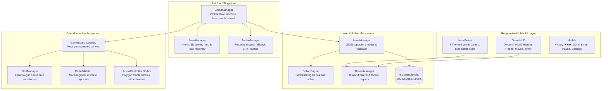

# 🏹 Arrow Escape (Arrows Puzzle Game)

<div align="center">


<p align="center">
  <b>A tactile, high-density casual logic puzzle game engineered for mobile.</b><br>
  Guide multi-segment winding arrows off saturated boards, navigate bottleneck labyrinths, and escape with zero deadlocks.
</p>

</div>

---

## 🌟 Executive Summary

**Arrow Escape** is a publication-ready 2D logic puzzle game developed in **Godot Engine 4.x (GDScript)**. Designed with mobile-first tactile mechanics inspired by top-tier casual hits (*Arrows – Puzzle Escape*), players observe an intricate labyrinth of directional arrows, trace unobstructed exit trajectories, and tap arrows to slither them gracefully off the board without colliding.

The repository features an uncompromised, production-grade architecture with **200 algorithmically validated levels**, **8 thematic chapters**, **mathematical reverse-DAG generation**, **atomic disaster-proof save persistence**, and **automated continuous verification (V&V)**.

---

## 🎮 Gameplay & Core Mechanics

```
┌────────────────────────────────────────────────────────────────────────┐
│                          ARROW ESCAPE CORE LOOP                        │
│                                                                        │
│   [ Observe Grid ] ──► [ Tap Unobstructed Arrow ] ──► [ Slither Off ]  │
│          ▲                          │                        │         │
│          │ Obstacle Collision       ▼ Escaped                ▼         │
│          └────────────── [ Lose 1 Heart (out of 3) ]   [ +1 Combo ]    │
│                                     │                        │         │
│                               0 Hearts                       │ All Out │
│                                     ▼                        ▼         │
│                              [ Level Failed ]         [ Victory ★★★ ]  │
└────────────────────────────────────────────────────────────────────────┘
```

- **Multi-Segment Winding Arrows**: Arrows aren't limited to straight lines—they snake across the grid with 90° orthogonal bends, creating intricate interlocked spatial puzzles.
- **Polyline Slither Motion**: Unobstructed arrows slither smoothly along their multi-segment geometric vertices out of the board with continuous orientation alignment.
- **3-Hearts Penalty & Elastic Rebound**: Tapping an obstructed arrow triggers an elastic bonk recoil animation, loss of 1 heart, and combo streak reset.
- **Dynamic Combo Pitching**: Clear consecutive arrows without mistakes to trigger escalating pitch chimes and celebratory sound effects.
- **Chapter-Based Pacing**: Boards progress rhythmically from gentle 4x4 tutorials to intensely saturated 8x8 grandmaster labyrinths (up to 92.2% board fill).

---

## 🎨 8 Thematic Worlds & Dynamic Palettes

The 200 levels are categorized across 8 distinct thematic worlds, transitioning the background, header pills, and high-contrast arrow palettes seamlessly in real time:

| Chapter | World Name | Levels | Visual Theme & Mood | Grid Dimensions |
|:---:|:---|:---:|:---|:---:|
| **1** | **Sky Breeze** | 1 – 25 | Soft Ice-Blue (`#EBF3FC`) & Azure Blue | 4x4 $\to$ 7x7 |
| **2** | **Sunset Coral** | 26 – 50 | Warm Peach (`#FDF2EE`) & Coral Sunset | 7x7 $\to$ 8x8 |
| **3** | **Emerald Glade** | 51 – 75 | Mint Mist (`#EEF9F5`) & Lush Jade | 8x8 |
| **4** | **Amethyst Twilight** | 76 – 100 | Soft Lilac (`#F6F3FF`) & Royal Amethyst | 8x8 |
| **5** | **Oceanic Abyss** | 101 – 125 | Crisp Arctic Water (`#EAF6FF`) & Deep Marine | 8x8 |
| **6** | **Golden Dunes** | 126 – 150 | Sandstone Ivory (`#FDFBF2`) & Desert Gold | 8x8 |
| **7** | **Cherry Blossom** | 151 – 175 | Sakura Petal (`#FFF0F3`) & Crimson Ruby | 8x8 |
| **8** | **Midnight Obsidian** | 176 – 200 | Obsidian Dark Slate (`#181E24`) & Neon Accents | 8x8 |

---

## 🏗️ Architectural Topology



---

## 🔬 Mathematical Invariants & Algorithmic Design

### 1. Multi-Segment Polyline Path Invariant
Every arrow $A_i$ consists of an ordered sequence of 2D grid coordinates:
$$\text{Path}(A_i) = \langle p_0, p_1, \dots, p_k \rangle, \quad p_j = (c_j, r_j) \in \mathbb{Z}^2$$
where consecutive vertices are strictly orthogonally adjacent:
$$\forall j \in [0, k-1], \quad \|p_{j+1} - p_j\|_1 = |c_{j+1} - c_j| + |r_{j+1} - r_j| = 1$$

### 2. Arrowhead Direction & Discrete Raycasting
The arrowhead resides at $p_k$ facing direction $\mathbf{d} = p_k - p_{k-1}$. The escape path is the discrete infinite ray:
$$\text{Ray}(A_i) = \{ p_k + \lambda \cdot \mathbf{d} \mid \lambda \in \mathbb{Z}^+ \}$$
Arrow $A_i$ is **Escapable** if and only if:
$$\forall q \in \text{Ray}(A_i) \cap G, \quad \text{Occupied}(q) = 0$$

### 3. High-Density Reverse-DAG Generator
Levels are synthesized using a reverse topological order algorithm:
1. Puzzles are built in **reverse departure order**: arrows that escape last are placed first.
2. Mathematically guarantees **100% solvability with zero circular dependency deadlocks**.
3. Strict pre-save collision matrix prevents overlapping cells, reaching up to **92.2% board saturation**.

---

## 📁 Repository Structure

```
Arrow-Escape/
├── assets/
│   ├── audio/                  # Audio buses and SFX resources
│   └── themes/                 # default_theme.tres UI styling
├── data/
│   └── levels/                 # 200 pre-computed JSON level files (level_001.json - level_200.json)
├── docs/
│   ├── sops/                   # Standard Operating Procedures (SOP-00 to SOP-11)
│   └── STORE_METADATA.md       # Google Play Store listing & privacy disclosures
├── scenes/
│   ├── core/                   # Main.tscn, GameBoard.tscn, Arrow.tscn
│   ├── effects/                # ConfettiEffect.tscn celebration particle system
│   └── ui/                     # GameHUD, MainMenu, LevelSelect, Modals
├── scripts/
│   ├── autoload/               # GameManager, SaveManager, AudioManager
│   ├── core/                   # GridManager, PathValidator, ThemeManager, Main
│   ├── generator/              # generate_dense_levels.py Reverse-DAG generator
│   ├── solver/                 # SolverEngine (DFS backtracking solver)
│   └── ui/                     # UI controller scripts
├── tests/
│   ├── test_runner.gd          # Headless test orchestrator (7 test suites)
│   ├── test_grid_path.gd       # Raycasting truth-table verification
│   ├── test_solver.gd          # Backtracking solver verification
│   ├── test_levels.gd          # 200-level 100% mass solvability audit
│   ├── test_persistence.gd     # Atomic write & recovery verification
│   ├── test_click_input.gd     # Debounce gatekeeping & tap verification
│   ├── test_arrow_motion.gd    # Slither motion & center alignment verification
│   └── test_level_select_ui.gd # Level card label visibility & contrast verification
├── MASTER_IMPLEMENTATION_PLAN.md # Publication roadmap & engineering specs
├── MEMORY_GRAPH.md             # Knowledge topology & invariant router
└── project.godot               # Godot 4.x engine project configuration
```

---

## 🚀 Getting Started

### Prerequisites
- **Godot Engine 4.3+ or 4.7.x** (Standard 64-bit console or desktop build)
- **Git**

### Running in Godot Editor
1. Clone the repository:
   ```bash
   git clone https://github.com/DeveloperArslanAli/Arrow-Escape.git
   cd Arrow-Escape
   ```
2. Open **Godot Engine**, click **Import**, select `project.godot`, and press **Edit**.
3. Press **F5** (or click the Play button in the top-right corner) to launch the game.

### Automated Verification & Validation (Headless CLI)
The game includes an automated headless test runner that verifies geometry, solver algorithms, all 200 level files, persistence, input handling, and UI visibility:

```powershell
# Windows
& "path/to/godot_console.exe" --headless tests/TestRunner.tscn

# macOS / Linux
godot --headless tests/TestRunner.tscn
```

#### Test Suite Coverage:
```
=======================================================
   ARROW ESCAPE — AUTOMATED V&V TEST HARNESS
=======================================================
--> Running TestGridPath...
    [PASS] TestGridPath
--> Running TestSolver...
    [PASS] TestSolver
--> Running TestLevels (100% Solvability Verification)...
Verified 200 packaged levels successfully.
    [PASS] TestLevels (All packaged levels validated)
--> Running TestPersistence...
    [PASS] TestPersistence
--> Running TestClickInput (Tap & Motion Verification)...
    [PASS] TestClickInput (Arrow clicking and movement verified)
--> Running TestArrowMotion (Slither & Center Alignment)...
    [PASS] TestArrowMotion (Smooth slither motion verified)
--> Running TestLevelSelectUI (Card Visibility & Permanent Rendering)...
Verified all 200 level cards: 100% permanent visibility & high-contrast styling.
    [PASS] TestLevelSelectUI (All cards permanently visible)
=======================================================
TEST RUN COMPLETE: 7 Passed, 0 Failed
=======================================================
```

---

## 📱 Android Build & Export

The project is pre-configured with Android export presets in `export_presets.cfg`:
- **Target SDK**: Android 34 (Android 14 UpsideDownCake)
- **Min SDK**: Android 24 (Android 7.0 Nougat)
- **Supported Architectures**: `arm64-v8a`, `armeabi-v7a`
- **Orientation**: Portrait (720x1280 base viewport with dynamic safe-area insets)
- **Renderer**: `gl_compatibility` for ultra-low battery draw and steady 60 FPS on all chipsets.

Export command via Godot CLI:
```bash
godot --headless --export-release "Android" build/ArrowEscape.aab
```

---

## 🛡️ Atomic Disaster-Proof Save Protocol

Player progress (highest unlocked level, star ratings, best moves, and sound settings) is saved using a 3-step atomic write protocol:
1. Writes state payload to `user://arrow_escape_save.tmp`.
2. Validates JSON integrity and backs up current save to `user://arrow_escape_save.bak`.
3. Performs an atomic OS filesystem rename to `user://arrow_escape_save.json`.
4. In the event of an abrupt power-off or OS process termination, `SaveManager` automatically recovers progress from the backup without data loss.

---

## 📄 License & Attribution

This project is licensed under the **MIT License** — feel free to modify, distribute, or use it in commercial projects.

Developed with ❤️ by **[Arslan Ali](https://github.com/DeveloperArslanAli)**.
