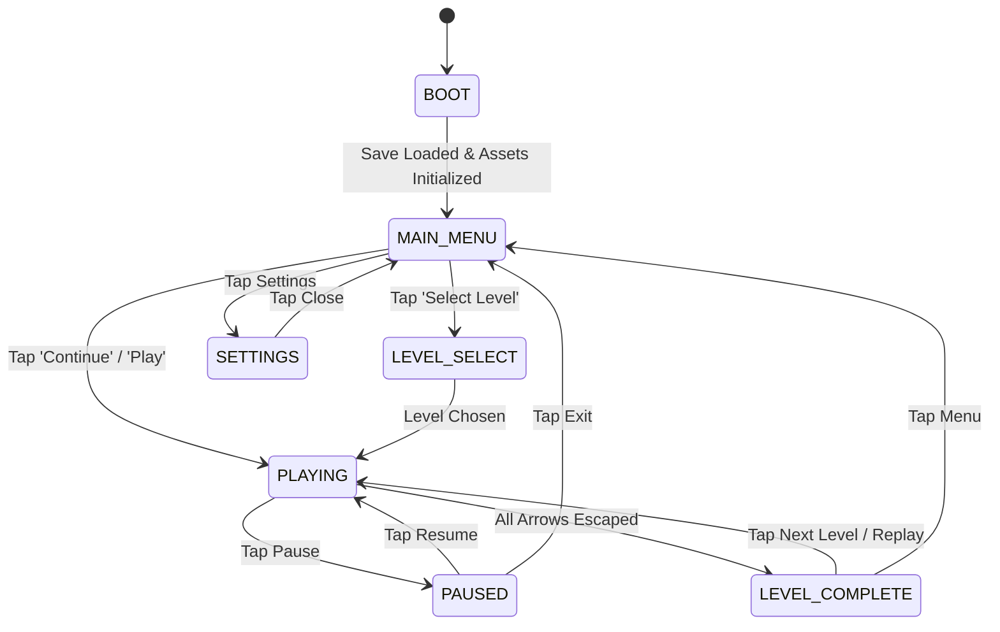

# SOP-05: Game State Lifecycle & Turn Flow
## Purpose & Scope
Details the finite state machine (FSM) governing game progression, scene transitions, turn counters, move history, pause/resume lifecycles, and win-condition triggering.

---

## 1. FINITE STATE MACHINE (FSM)

---

## 2. TURN FLOW & MOVE TRACKING

1. **Move Counter**:
   - Initialized to `0` when level starts.
   - Increments by `1` **only** upon a valid arrow escape move. Blocked taps do not increment the move count.
2. **Win Condition Invariant**:
   - Evaluated immediately after an arrow begins its exit animation:
     `remaining_arrows_count -= 1`
   - If `remaining_arrows_count == 0`:
     - Transition state to `LEVEL_COMPLETE`.
     - Disable all board touch inputs.
     - Calculate stars earned (comparing moves with level threshold).
     - Commit level completion to `SaveManager`.
     - Emit signal `GameManager.level_completed(level_id, moves, stars)`.
     - Trigger victory fanfare SFX & particle burst after 0.2s delay.
3. **Restart Operation**:
   - Clears active grid nodes.
   - Re-instantiates board from cached level JSON.
   - Resets move counter to `0`.
   - Leaves unlocked progress intact.
