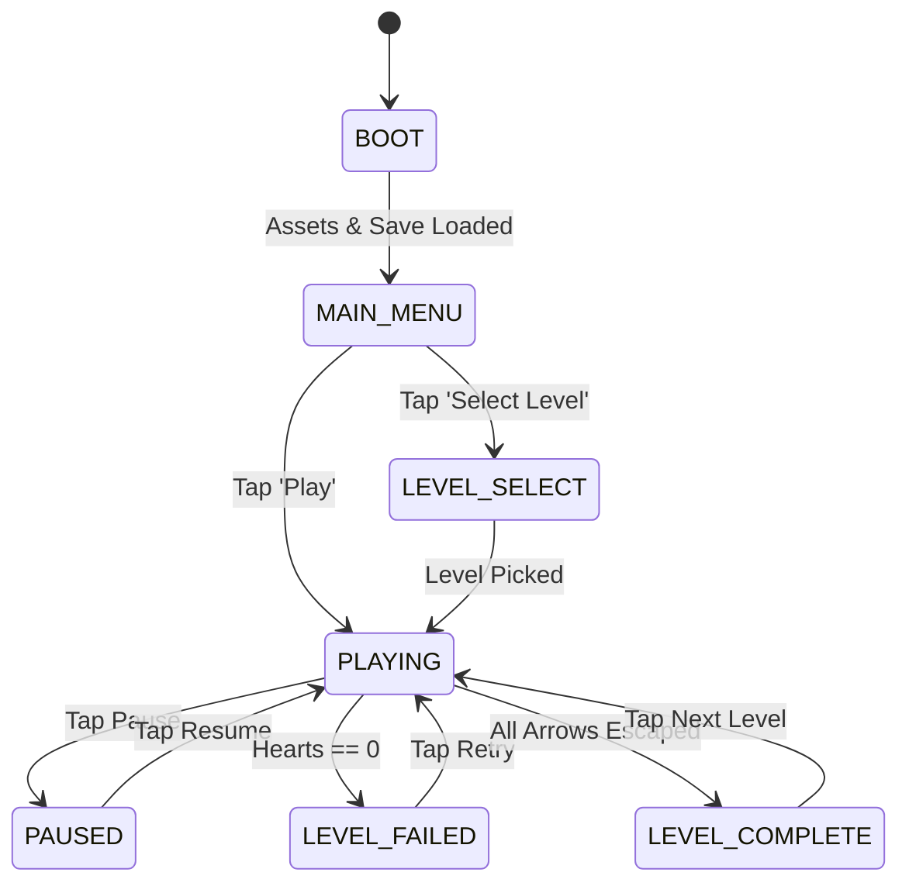

# SOP-05: Game State Lifecycle, Hearts (Lives) & Timer
## Purpose & Scope
Governs the game state machine, 3-hearts life tracking, live elapsed timer, fail/restart flows, and victory triggers.

---

## 1. EXTENDED STATE MACHINE

---

## 2. HEARTS & TIMER INVARIANTS

1. **Hearts (3 Lives)**:
   - Initialized to `3` on `start_level()`.
   - Decremented by `1` when player taps an arrow whose path is blocked.
   - UI reflects `❤️❤️❤️`, `❤️❤️💔`, `❤️💔💔`, `💔💔💔`.
   - On 0 hearts: input locks immediately, transition to `LEVEL_FAILED`.
2. **Timer**:
   - Live timer increments in `_process(delta)` during `PLAYING` state.
   - Formatted as `⏱ Xs` (or `M:SS` if > 60s).
   - Displayed in the left top pill widget matching the screenshot.
